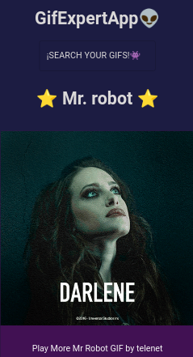

🔰 My personal website.

## 💻Preview

Check out: [SerachYourGifs!](https://pixe-l.github.io/Searching-gifs/)

## 👨‍💻About

My first project to react, by the hand of master Fernando Herrera. Implementing one of the best JavaScript libraries, this is Material UI.

I know it's a project very easy, but leaves me a great teaching and learnig of the bases of React.

## 👽Technologies

- **JavaScript**
- **React**
- **Material UI**
- **CSS**

## 🤲Contributing

You can send me your comments on [Twitter](https://twitter.com/iPiixeeL) or [Facebook](https://www.facebook.com/tutospixel), to continue improving the project.
